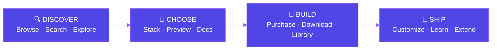
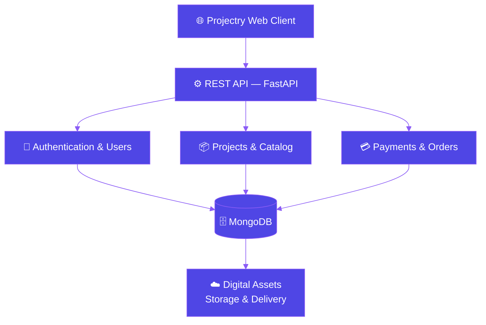
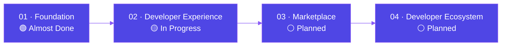
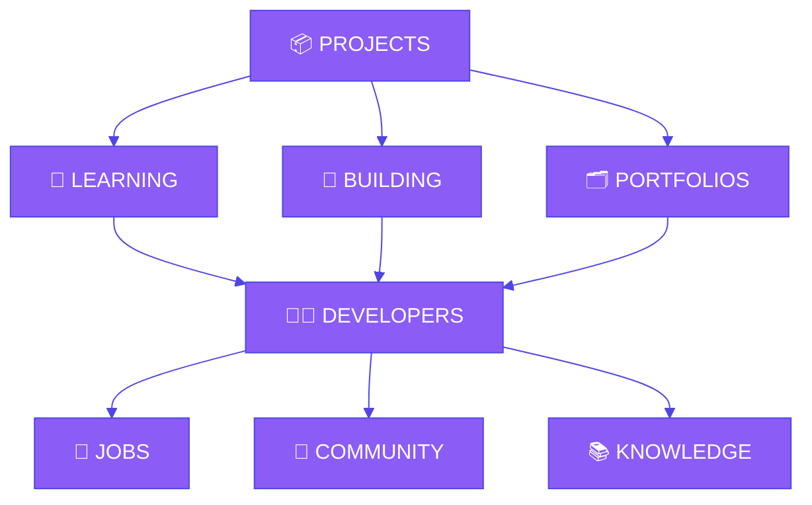

 

 

 

## ⚡ The Idea

Most developers don't need another tutorial. They need something **real to build on**.

Projectry is a curated ecosystem where developers discover complete software projects, study the source, understand the architecture, customize the implementation, and turn what they learn into something of their own.

> ### "Don't just follow tutorials. Build from something real."

`Real Source` &nbsp;·&nbsp; `Real Architecture` &nbsp;·&nbsp; `Real Ownership`

<a href="#top">↑ back to top</a>

 

## ✦ What is Projectry?

<table>
<tr>
<td width="50%" valign="top">

### 💻 Complete Projects
Real applications with source code, documentation, assets, and everything needed to actually understand the project — not fragments, not snippets.

</td>
<td width="50%" valign="top">

### 🧠 Learn by Building
See how authentication, APIs, databases, payments, and architecture fit together in code shaped like production, not like a demo.

</td>
</tr>
<tr>
<td width="50%" valign="top">

### 📦 A Library, Not a Download Folder
Everything you get stays organized in a personal library — controlled access, secure delivery, and updates as projects evolve.

</td>
<td width="50%" valign="top">

### 🚀 A Marketplace in Progress
Starting curated and centrally reviewed, built from day one to eventually let developers publish and sell their own projects.

</td>
</tr>
</table>

<a href="#top">↑ back to top</a>

 

## 🧩 The Projectry Experience

<a href="#top">↑ back to top</a>

 

## 🏗️ Architecture

Projectry is designed as a modern web platform with a clean separation between the user experience, application services, data, and digital assets.

> Architecture evolves with the product — this reflects platform direction, not a claim that every component is deployed today.

<a href="#top">↑ back to top</a>

 

## 🛠️ Technology

**Frontend**

**Backend**

**Data & Infrastructure**

<a href="#top">↑ back to top</a>

 

## ⭐ Featured

<table>
<tr>
<td width="50%" valign="top">

### 🛒 Projectry Platform
**The core web application.**
Marketplace experience, project discovery, authentication, purchasing, user libraries, and digital delivery.

  

</td>
<td width="50%" valign="top">

### 🧪 Projectry Experiments
**Ideas, prototypes, and experiments.**
New interfaces, developer experiences, discovery mechanisms, and ways to make learning through software more engaging.

  

</td>
</tr>
</table>

<a href="#top">↑ back to top</a>

 

## 🗺️ Roadmap

<b>01 — Foundation</b> &nbsp; 

 

- [x] Project discovery
- [x] Project catalog
- [x] Project detail pages
- [x] User accounts
- [x] Authentication
- [x] Digital purchases
- [x] Project library
- [x] Secure digital delivery
- [x] Reviews & ratings
- [x] Wishlist
- [ ] Promotions

<b>02 — Developer Experience</b> &nbsp; 

 

- [x] Version history
- [x] Download history
- [x] Project updates
- [x] Related projects
- [ ] Project bundles
- [ ] Developer profiles
- [ ] Rich project documentation

<b>03 — Marketplace</b> &nbsp; 

 

- [ ] Developer accounts
- [ ] Project submissions
- [ ] Seller dashboards
- [ ] Moderation
- [ ] Revenue & payouts
- [ ] Project verification

<b>04 — Developer Ecosystem</b> &nbsp; 

 

- [ ] Developer portfolios
- [ ] Technical publishing
- [ ] Community
- [ ] Job discovery
- [ ] Developer resources
- [ ] Learning ecosystem

<a href="#top">↑ back to top</a>

 

## 🔐 Engineering Philosophy

<table>
<tr>
<td width="50%" valign="top">

**Security is a feature.**
Payments, authentication, authorization, downloads, and user data aren't afterthoughts.

</td>
<td width="50%" valign="top">

**Real projects over toy projects.**
Software that demonstrates patterns developers actually encounter in production.

</td>
</tr>
<tr>
<td width="50%" valign="top">

**Understand the code.**
The goal isn't just a working application — it's understanding how it works, why it works, and how to change it.

</td>
<td width="50%" valign="top">

**Ship → Learn → Improve.**
Projectry follows its own philosophy: build something real, learn from it, improve it, ship the next version.

</td>
</tr>
</table>

<a href="#top">↑ back to top</a>

 

## 🌌 Where We're Going

Projectry starts with **software projects**. The larger vision is a developer ecosystem connecting learning, building, and showing what you've built.

> **Make it easier for developers to go from learning something → building something → showing something → doing something with it.**

<a href="#top">↑ back to top</a>

### Build something worth understanding.

**[🌐 projectry.dev](https://projectry.dev)**

